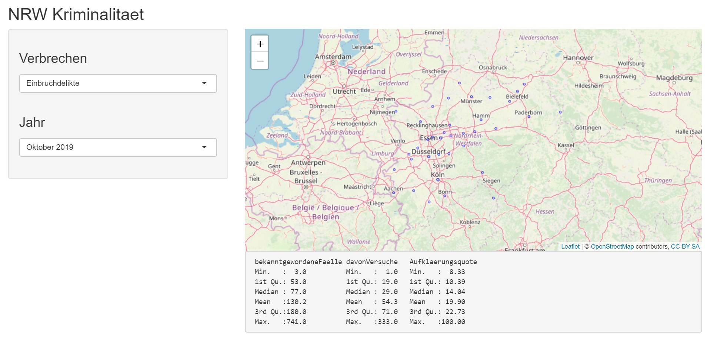
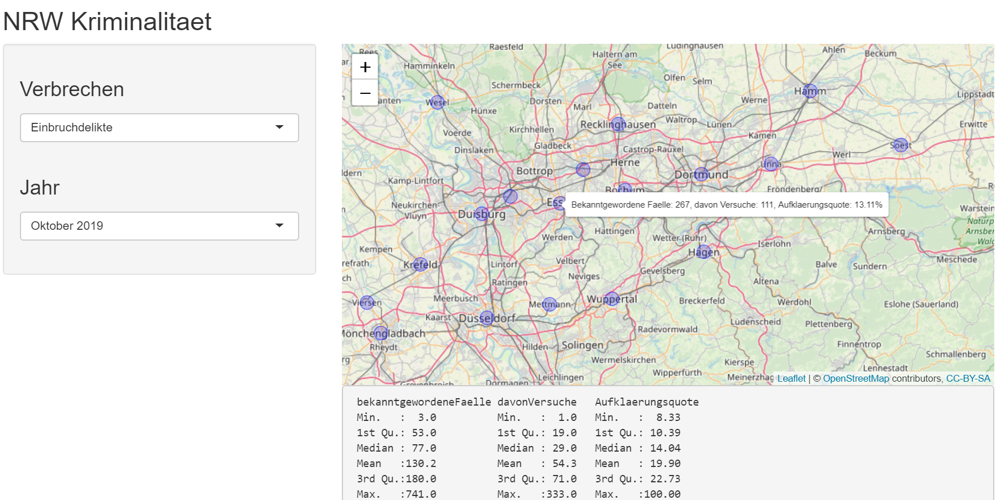

<!-- README.md is generated from README.Rmd. Please edit that file -->

# NRW_Kriminalitaet

```{r setup, include = FALSE}
knitr::opts_chunk$set(
  collapse = TRUE,
  comment = "#>",
  fig.path = "man/figures/README-"
)
```

## Overview

NRW_Kriminalitaet is a R Shiny project to create an interactive map of crime statistics for 37 cities in North Rhine-Westphalia (state in Germany).

```{r, out.width = "100%", echo = FALSE}

```

## Data Origin

The data was obtained from database [GOVDATA](https://www.govdata.de/).
The original .csv file containing the crime statistics for North Rhine-Westphalia can be downloaded [here](https://polizei.nrw/sites/default/files/2019-11/10_2019_Open_Gov.csv). 
The file was last updated on January 10, 2020.

## Data Content

The .csv file contains numbers for ten different crimes:

```{r, eval = FALSE}
[1] Einbruchdelikte                                                                           [2] Wohnungseinbruchdiebstahl                                                                 [3] Tageswohnungs-einbruchdiebstahl                                                           [4] Delikte der Straßenkriminalität                                                           [5] Vergewaltigung/sexuelle Nötigung/sexueller Übergriff (besonders schwere Fälle einschl. Todesfolge)
[6] Raubüberfälle auf Straßen, Wegen oder Plätzen                                             [7] Gefährliche und schwere Körperverletzung auf Straßen, Wegen oder Plätzen                  [8] Taschendiebstahl                                                                          [9] Diebstahl von Fahrrädern                                                                  [10] Gewaltkriminalität 
```

Numbers are available for 14 months: from October 2018 to October 2019 and for October 2014.

## Data Manipulation

The data was filtered to contain only the data for the following 37 cities in North Rhine-Westphalia:

```{r, eval = FALSE}
 [1] Aachen          Bielefeld       Bochum          Bonn            Dortmund       
 [6] Duisburg        Düsseldorf      Essen           Gelsenkirchen   Hagen          
[11] Hamm            Köln            Krefeld         Mönchengladbach Münster        
[16] Oberhausen      Recklinghausen  Wuppertal       Borken          Coesfeld       
[21] Düren           Euskirchen      Gütersloh       Heinsberg       Herford        
[26] Höxter          Kleve           Lippe           Mettmann        Olpe           
[31] Paderborn       Soest           Steinfurt       Unna            Viersen        
[36] Warendorf       Wesel
```

Additionally, the longitude and latitude for each city was added via [OpenStreetMap ](http://nominatim.openstreetmap.org/search).

## Implementation

Three R packages were used for implementation:
```{r, eval = FALSE}
library(shiny)
library(leaflet)
library(dplyr)
```

Via two select list input controls on the left specific crime ("Verbrechen") and year ("Jahr") can be selected.
Hovering the mouse over the cities marked via blue circles reveals the selected numbers for this city.

```{r, out.width = "100%", echo = FALSE}

```

Additionally, basic statistics for the selected crime and year are shown below the map.
